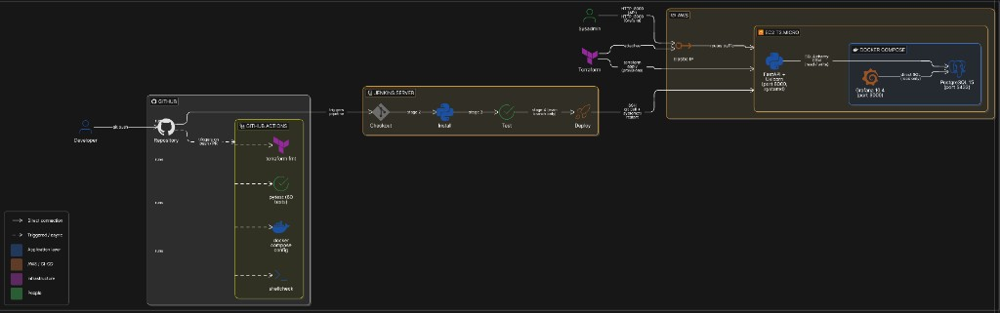
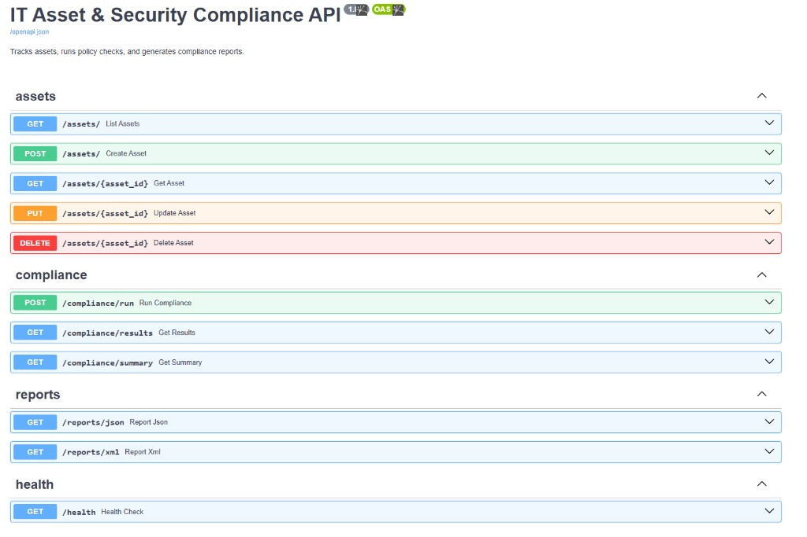
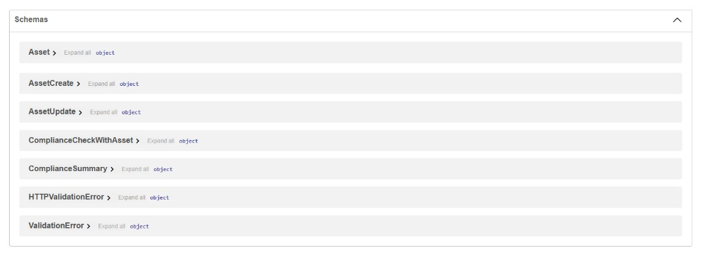
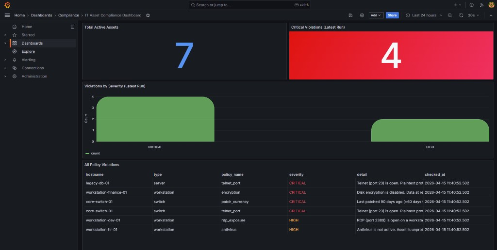

# IT Asset & Security Compliance Tool

[](https://github.com/SirADarbi/It-Asset-Compliance/actions/workflows/ci.yml)

### Purpose

You cannot defend IT assets you do not measure. Useful measurement goes beyond a device list: patch age, risky services (for example Telnet), disk encryption, antivirus status, and a stored history you can show during an audit or after an incident.

This repository implements that workflow. You store assets in PostgreSQL, run a fixed set of compliance checks in one request, and persist each result with a severity. Grafana reads the same database for dashboards. The REST API exposes JSON and XML reports so other tools (SIEM, ticketing, scripts) can consume the data.

**Features:** create, read, update, and delete assets; run all policies on demand; filter results; Grafana panels; JSON and XML report downloads.

**Stack:** FastAPI, PostgreSQL, Grafana, Docker Compose, Terraform on AWS, GitHub Actions, and optional Jenkins.

### Architecture

**Flow.** You push code to GitHub. **GitHub Actions** runs on every push to `main` and on pull requests that target `main`. It installs dependencies, runs pytest, checks Terraform formatting, validates the Docker Compose file, and lints shell scripts. **Jenkins** is optional: it can run a similar install and test sequence, then deploy to your server over SSH when the branch is `main`. **Terraform** provisions a small Ubuntu EC2 instance with an Elastic IP. On the server, **FastAPI** runs as a **systemd** service; **PostgreSQL** and **Grafana** run under **Docker Compose**. The API reads and writes the database; Grafana runs read-only queries for charts. By default you reach the API on port **8000** and Grafana on **3000** over HTTP.

<p align="center">
  
</p>

#### OpenAPI (Swagger)

When the API is running locally, browse to **http://localhost:8000/docs** for interactive documentation. The machine-readable OpenAPI definition is at **http://localhost:8000/openapi.json**. The screenshots below list the endpoint groups and the main request/response schemas.

<p align="center">
  
</p>

<p align="center">
  
</p>

## Architectural decisions

**FastAPI on the host, database and Grafana in Docker.** The API runs under systemd so a deploy is usually `git pull` and `systemctl restart`. Only PostgreSQL and Grafana run in containers, which pins their versions without forcing the whole backend into an image. The API connects to Postgres on the host; Grafana uses read-only SQL against the same data.

**Small AWS footprint.** Terraform creates one Ubuntu EC2 instance (type is configurable; default `t2.micro`), a security group for SSH and application ports, and an Elastic IP. That avoids the overhead of Kubernetes for a single API and a dashboard.

**GitHub Actions and Jenkins together on purpose.**

- **GitHub Actions** is the default continuous integration gate. It runs on pushes and pull requests to `main`: install Python dependencies, run pytest, validate Terraform and Compose files, and lint shell scripts. Results show up in GitHub; contributors and forks do not need your Jenkins server.
- **Jenkins** is optional. It fits teams that already use Jenkins or want a pipeline that checks out code, tests it, then deploys over SSH to EC2 from `main`. The test stage overlaps Actions deliberately so the repo can show both a GitHub-native workflow and a traditional Jenkins deploy.

**Compliance logic lives in application code.** Policies are ordinary Python functions over SQLAlchemy models. That keeps the codebase easy to follow; a larger product might move rules into a separate service or rules engine.

## Limitations and possible improvements

**Production readiness.** The examples assume HTTP and broad security-group access. For real production you would add TLS, protect the API with authentication and authorization, store secrets in AWS Systems Manager Parameter Store or Secrets Manager (not only `.env` files), and narrow network access to known clients or VPNs.

**Product depth.** The schema and rule set are intentionally small. Natural next steps include database migrations as tables grow, scheduled or triggered compliance runs, richer policies (custom fields, exceptions, ownership), webhooks when checks fail, integration tests against PostgreSQL, and security scanning in CI.

**Operations.** Beyond Grafana dashboards, you might add structured logs, metrics, distributed tracing, and alerts when critical checks fail.

## Extending the project

Ideas that build naturally on this design:

- Import assets from real inventory (Microsoft Endpoint Manager, cloud APIs) instead of typing them in by hand.
- Forward violations to a SIEM or ticketing system (for example Jira or ServiceNow).
- Add SSO for Grafana and role-based access for the API.
- Support multiple tenants on one deployment if teams share infrastructure.
- Ship signed or archived reports for auditors.
- Run checks from agents or from the server when endpoints are reachable.

---

## Prerequisites

| Tool | Version |
|------|---------|
| Docker & Docker Compose | 24+ |
| Python | 3.11+ |
| Terraform | 1.3+ |
| AWS CLI | 2+ |

---

## Local Development Quickstart

### 1. Start PostgreSQL + Grafana

```bash
docker compose up -d
```

### 2. Configure environment

```bash
cp .env.example backend/.env
# Edit backend/.env if needed; defaults work for local Docker setup
```

### 3. Install Python dependencies

```bash
cd backend
pip install -r requirements.txt
```

### 4. Seed the database

```bash
python3 seed.py
```

### 5. Start the API

```bash
uvicorn main:app --reload --host 0.0.0.0 --port 8000
```

### 6. Run the first compliance scan

```bash
curl -X POST http://localhost:8000/compliance/run
```

### 7. Run tests

```bash
pytest tests/ -v
```

---

## Service URLs

| Service | URL | Credentials |
|---------|-----|-------------|
| API docs (Swagger) | http://localhost:8000/docs | (none) |
| API docs (ReDoc) | http://localhost:8000/redoc | (none) |
| Grafana dashboard | http://localhost:3000 | admin / admin123 |

After you seed assets and call `POST /compliance/run`, the **IT Asset Compliance** Grafana dashboard shows how many assets are active, how many critical issues exist, a breakdown by severity, and a table of failed checks (hostname, rule name, severity, detail).



---

## API Overview

### Assets
| Method | Path | Description |
|--------|------|-------------|
| GET | `/assets` | List all assets |
| GET | `/assets/{id}` | Get one asset |
| POST | `/assets` | Create an asset |
| PUT | `/assets/{id}` | Update an asset |
| DELETE | `/assets/{id}` | Delete an asset |

### Compliance
| Method | Path | Description |
|--------|------|-------------|
| POST | `/compliance/run` | Run all policy checks |
| GET | `/compliance/results` | Get results (filter: `?passed=false&severity=CRITICAL`) |
| GET | `/compliance/summary` | Counts by severity + last run time |

### Reports
| Method | Path | Description |
|--------|------|-------------|
| GET | `/reports/json` | Download violations as JSON |
| GET | `/reports/xml` | Download violations as `compliance_report.xml` |

---

## Terraform (AWS deploy)

```bash
cd infra/terraform

# Initialise providers
terraform init

# Preview changes
terraform plan -var="key_pair_name=my-key"

# Apply
terraform apply -var="key_pair_name=my-key"

# Get the Elastic IP
terraform output elastic_ip
```

Resources created:
- EC2 t2.micro (Ubuntu 22.04)
- Security group (ports 22, 8000, 3000)
- Elastic IP

On first boot, `user_data.sh` installs dependencies, clones this repository, and enables the `compliance-api` systemd service.

---

## Jenkins CI/CD Setup

1. Create a **Pipeline** job in Jenkins.
2. Set the job to use the `Jenkinsfile` in the repository root.
3. Configure these environment variables (globally under **Manage Jenkins → System** or on the job):
   - `EC2_HOST`: the Elastic IP from `terraform output elastic_ip`
   - `SSH_KEY_PATH`: full path to the SSH private key (`.pem`) on the Jenkins agent
4. Stages run in order: checkout code, install requirements from `backend/requirements.txt`, run `pytest backend/tests/` (a failing test fails the build), then on `main` only SSH to the server to pull the latest code and restart the service.

---

## GitHub Actions

Workflow file: `.github/workflows/ci.yml`. It runs on pushes to `main` and on pull requests that target `main`.

Two jobs run in parallel: **Python tests** (install dependencies, run pytest) and **infrastructure checks** (`docker compose config`, ShellCheck on deploy scripts, `terraform fmt -check` on `infra/terraform`).

---

## Policy Rules

| Rule | Severity | Trigger |
|------|----------|---------|
| `patch_currency` | HIGH / CRITICAL | >30 days / >60 days since last patch |
| `telnet_port` | CRITICAL | Port 23 open |
| `encryption` | CRITICAL | Disk encryption disabled |
| `antivirus` | HIGH | Antivirus not active |
| `password_policy` | MEDIUM | Password policy non-compliant |
| `rdp_exposure` | HIGH | Port 3389 open on workstation/laptop |
| `ssh_on_workstation` | MEDIUM | Port 22 open on workstation/laptop |

---

## Stopping

```bash
docker compose down        # keep data volumes
docker compose down -v     # destroy volumes
```
